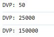
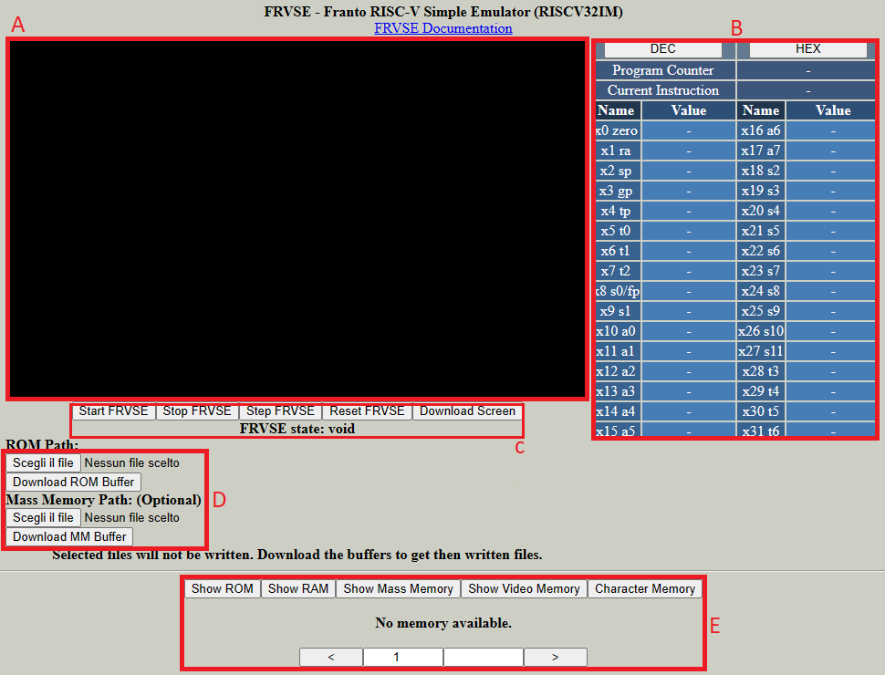
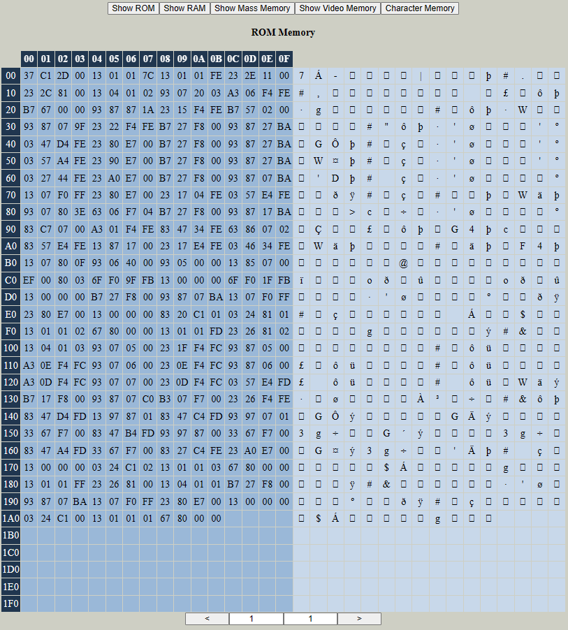

# FRVSE Documentation

FRVSE (Franto RISC-V Simple Emulator) is a RISC-V emulator, currently it only support the 32-bit IM (RISCV32IM) architecture.

This project is the web version of the original FRVSE, a C .DLL with a freeGLUT GUI. The original project is currently not available on github.

FRVSE is intended for educational purposes and is pretty straightforward to use.

FRVSE is just like a small computer. There is a CPU, a ROM, a RAM and an handful of peripherals such as Mass Memory, a screen and registers [(See Full List)](#frvse-components)
you can watch the state of the system registers(PC, reg[0]-reg[31]) and the content of the peripherals using the GUI.

To make FRVSE run code, you need to upload a .bin file, containing bare metal binaries, in the ROM path, and press the Start FRVSE button (or the Step FRVSE, if you want to step).
To create bare metal binaries to feed into FRVSE you just need to compile your code into RISC-V machine language. Bare metal binaries means it doesnt need to have things like headers or similiar
like an .exe/.elf file, bust just binary machine instructions.

FRVSE's Reset Vector is at the first address of the ROM memory. So when the CPU is reset, it fetch the first 4 byte of the ROM Memory and decodes them as an instruction. That's you need to upload
a binary file as your ROM Memory.

Personally, I compile my code using riscv-gcc. In FOLDER, you can find a .C file containing a little library to write code for FRVSE, and in the same folder you can find a .bat file to compile
this .C file into bare metal binary.

FRVSE's peripherals are memory mapped, being RISC-V a memory mapped architecture. To write or read from a memory 
just write code that writes or read from the addresses reserved [(See Memory Map)](#memory-map) for the peripherals you want to use (See Examples)


## FRVSE COMPONENTS

**Check [Memory Map](#memory-map) for components address table**

### ROM MEMORY:

A read/write memory emulating a Flash memory. It's where FRVSE start executing the code. Currently it have a maximum size of 3MB. 
The user must upload a binary file serving as the Flash memory. The memory can be written but the uploaded file will not be modified. If you need the written file, 
you can downlaod it using the "Download ROM Buffer" button. 
This memory is mandatory and must be present when the emulator is started, otherwise there will be an error.
See ROM Memory Example

### RAM MEMORY:

The RAM of the emulator, created when the emulator starts, with a size of 5MB. When the emulator is resetted, the memory is also resetted.
See RAM Memory Example

### Mass Memory:

A read/write memory emulating a mass memory. It have a maximum size of 8MB. It may be used to store big data to be used in the code like images. 
This memory is optional and can be not uploaded. If you try to write or read the Mass Memory when is not uploaded, nothing will happen.
If the uploaded Mass Memory is written, the original file will not be modified. If you need the written file, you can download it using the "Download MM Buffer" button.
See Mass Memory Example

### Video Memory:

A read/write memory emulating a Video Memory. It is created when the emulator is started. It can represent a 320x200 screen, or 64000 pixels, each pixel represented by 4 byte
for RGBA notation (the alpha channel is disabled). So the total size of the memory 256.000 bytes, or 256KB. The memory is updated in realtime and painted in the GUI.
See Video Memory Example

### Text Memory:

A read/write memory that allows you to easily print characters on the screen. FRVSE text mode can print 8x8 pixels character on the 320x200 screen, meaning you can have 1000 characters,
disposed in 40 rows and 25 columns. In the Text Memory, each character is represented by 4 bytes. There are 1000 character, so the memory is 4000 bytes long.
The 4 byte to represent a character are structured this way:

| 31-24  | 23-16 | 15-8 | 7-0 |
| ------------- | ------------- | ------------- | ------------- |
| character font  | ascii character  | character color  | background color  |

**character font:**
select the font to print. See [Text Memory Font values](#text-mode-fonts)

**ASCII character:**
the character you want to draw

**character color:**
The color of the character, using the [VGA Palette](#vga-palette).

**background color:**
the color of the character background, using the [VGA Palette](#vga-palette).

writing these 4 byte in the Text Memory will draw a character on the screen.
See Text Memory Example

### Stop Register:

A 1 byte write only register. If written, it stops the emulator. Useful to be put at the end of your code.
See Stop Register Example

### Keycode Register:

A 1 byte read only register. It's constantly updated with the currently pressed keyboard key.
See Keycode Register Example


## Memory Map
| Start Address  | Device Name | R/W | Size | Word Size |
| ------------- | ------------- | ------------- | ------------- | ------------- |
| 0x0  | ROM MEMORY  | RW  | 0x2DC6C0, 3MB  | 1 byte |
| 0x2DC6C0  | RAM MEMORY  | RW  | 0x4C4B40, 5MB  | 1 byte |
| 0x7A1200  | MASS MEMORY  | RW  | 0x7A1200, 8MB  | 1 byte |
| 0xF42400  | VIDEO MEMORY  | RW  | 0x3E800, 256KB  | 4 byte |
| 0xF80C00  | TEXT MODE MEMORY  | RW  | 0xFA0, 4KB  | 4 byte |
| 0xF81BA0  | STOP REGISTER  | W  | 1 byte  | 1 byte |
| 0xF81BA1  | KEYCODE REGISTER  | R  | 1 byte  | 1 byte |
| 0xF81BA2  | DEBUG VALUE PORT  | W  | 4 byte  | -- |

## VGA Palette


## Text Mode Fonts
| Value  | Name | Description | Author | Show |
| ------------- | ------------- | ------------- | ------------- | ------------- |
| 0  | font8x8_basic | 8x8 font map for unicode points U+0000 - U+007F (basic latin) | dhepper | [show](https://github.com/dhepper/font8x8/blob/master/font8x8_basic.h) |
| 1  | font8x8_block | 8x8 font map for unicode points U+2580 - U+259F (block elements) | dhepper | [show](https://github.com/dhepper/font8x8/blob/master/font8x8_block.h) |
| 2  | font8x8_box | 8x8 font map for unicode points U+2500 - U+257F (box drawing) | dhepper | [show](https://github.com/dhepper/font8x8/blob/master/font8x8_box.h) |
| 3  | font8x8_ext_latin | 8x8 font map for unicode points U+00A0 - U+00FF (extended latin) | dhepper | [show](https://github.com/dhepper/font8x8/blob/master/font8x8_ext_latin.h) |
| 4  | font8x8_greek | 8x8 font map for unicode points U+0390 - U+03C9 (greek characters) | dhepper | [show](https://github.com/dhepper/font8x8/blob/master/font8x8_greek.h) |
| 5  | font8x8_hiragana | 8x8 font map for unicode points U+3040 - U+309F (Hiragana) | dhepper | [show](https://github.com/dhepper/font8x8/blob/master/font8x8_hiragana.h) |
| 6  | Code page 437 | Character set of the original IBM PC | - | [show](https://en.wikipedia.org/wiki/Code_page_437#/media/File:Codepage-437.png) |
| 7  | Paul Lombard 8x8 1 bit pixel set | Simple set of a bunch of useful things for a game | [Paul Lombard](https://github.com/Pomb) | [show](https://opengameart.org/content/8x8-1-bit-pixel-set) |

## Coding for FRVSE
This section explain how to write code for FRVSE in C language. The code is compiled with riscv-gcc

The entry point for gcc programs is _start(), so you want to add it to your .C file instead of main()

remember to not put functions above the _start() function or they will get executed first as their machine language will be above the _start() one. The code you want to be executed first by the emulator must stay at the top.

You can still put things like macros or prototypes, as they are compiler/preprocessor matter and they are not compiled in machine language.

Another things you need to do is to set the "x2 sp" register, the stack address register, to make the compiled .C code to work.


this is the bare basic you need to start coding for FRVSE. I decided to put the stack address into the RAM. RAM start address is 0x2DC6C0, and since stack grows downward, i added 100 byte of space from the start, so 0x2DC7C0.
```
asm("li sp, 0x2DC7C0;");

void _start()
{
  //code
}
```
## Write/read the ROM, RAM and Mass Memory
to write or read from these memories, just write o read to a pointer having their address as value.

for example, if you want to write to the first byte of the RAM Memory:
```
*((unsigned char*)0x2DC6C0) = 0xFF;
```
or to read the first two byte of ROM Memory:
```
unsigned short ROM_word = *((unsigned short*)0x0);
```
something more complex: fill an array of 10 ints, with 32bit words fetched from Mass Memory starting from a specified offset:
```
unsigned int arr[10];
char offset = 16; 
unsigned int* MM_address = 0x7A1200;
MM_address += offset; //start from 0x7A1200 + (16*4) = 0x7A1264
for(char i = 0; i < 10; i++)
{
  arr[i] = *MM_address;
  MM_address++;
}
```
## Write/read from Video Memory
In this Memory there are 64.000 4byte words, each one representing a pixel. You can write a pixel (it will be updated on the screen)or read the value of a pixel.

To set the rgb value of the first pixel:
```
unsigned char r = 90;
unsigned char g = 235;
unsigned char b = 232;
*((unsigned int*)0xF42400) = (r << 24) | (g << 16) | (b << 8);
```
or:
```
unsigned char r = 90;
unsigned char g = 235;
unsigned char b = 232;
*((unsigned char*)0xF42400) = r;
*((unsigned char*)0xF42401) = g;
*((unsigned char*)0xF42402) = b;
```
The alpha channel can be left void as it's not used by FRVSE.

To set the first pixels of the second and third row on the screen:
```
unsigned char r = 90;
unsigned char g = 235;
unsigned char b = 232;

unsigned int* VM_addr = 0xF42400;

VM_addr += 320;
*VM_addr = (r << 24) | (g << 16) | (b << 8);
VM_addr += 320;
*VM_addr = (r << 24) | (g << 16) | (b << 8);
```
## Write/read from Text Memory
The Text Memory can store 1000 32bit entries each one representing a character to be printed on the screen and translated in pixels inside the Video Memory.

The Text Memory allows to write 1000 characters on the screen, disposed in 40 rows and 25 columns.

The 32bit word used to represented a character can be seen [here](#text-memory)

Example:
```
unsigned char font = 0;
unsigned char charac = 'a';
unsigned char char_color = 0x1;
unsigned char bck_color = 0x2;
*((unsigned int*)0xF80C00) = (font << 24) | (charac << 16) | (char_color << 8) | bck_color;
```
This will print the 'a' character at the fist position of the 40x25 grid. The character will have the 0x1 color in the VGA palette (blue), and the background of the character will have the color 0x2 in the VGA palette (green).


the "font" field allows you so choose [different fonts](#text-mode-fonts) to use. The ones you want to use for normal usage are the "font8x8_basic" or the "code page 437" fonts. The other are for different alphabets
(greek, hiragana) while the others are graphic ones (graphical element like "font8x8_block" or sprites like "Paul Lombard 8x8 1 bit pixel set")

Fonts/Text Memory showcase:
```
write_character(0, 0, 'a', 0x20, 0x60);
write_character(1, 1, 5, 0x21, 0x61);
write_character(2, 2, 0xC, 0x22, 0x62);
write_character(3, 3, 4, 0x23, 0x63);
write_character(4, 4, 8, 0x24, 0x64);
write_character(5, 5, 0xB, 0x25, 0x65);
write_character(6, 6, 1, 0x26, 0x66);
write_character(7, 7, 1, 0x27, 0x67);

void write_character(unsigned short pos, unsigned char font, unsigned char ascii, unsigned char char_color, unsigned char background_color)
{
	unsigned int addr = 0xF80C00+pos;
	*((unsigned int*)addr) = (font << 24) | (ascii << 16) | (char_color << 8) | background_color;
}
```
The result:


### VGA Palette special values
in the [VGA palette](#vga-palette) you can see that the last 8 colors are all black. Since black color is already present at the top of the palette, I decided to reserve these last 8 values to special values.
If one of these value is assigned at the character or its background, instead of a color, a special graphic operation is performed:

| Value  | Operation |
| ------------- | ------------- |
| 0xF8  | Transparency  |
| 0xF9  | reserved  |
| 0xFA  | reserved  |
| 0xFB  | reserved  |
| 0xFC  | reserved  |
| 0xFD  | reserved  |
| 0xFE  | reserved  |
| 0xFF  | reserved  |

Red 'A' with transparent background and transparent 'B' with yellow background:
```
write_character(0, 0, 'A', 0x4, 0xF8);
write_character(1, 0, 'B', 0xF8, 0xE);

void write_character(unsigned short pos, unsigned char font, unsigned char ascii, unsigned char char_color, unsigned char background_color)
{
	unsigned int addr = 0xF80C00+pos;
	*((unsigned int*)addr) = (font << 24) | (ascii << 16) | (char_color << 8) | background_color;
}
```
Result:


## Stop register
The stop register is a 8-bit write-only register. Writing anything in this register will result in FRVSE going into Stopped state.
```
*((unsigned char*)0xF81BA0) = 0xFF;
```
This register is useful to be put at the end of your code, preventing FRVSE to overflow and fetching random data as instructions.

## Keycode register
The Keycode register is a 8-bit read-only. It contains the current pressed key on the physical keyboard.
When no key is pressed, the Keycode register value is 0, otherwise it contains a [keycode](https://www.toptal.com/developers/keycode)
```
unsigned char keycode = *((unsigned char*)0xF81BA1);
```
## Debug Value Port
The Debug Value Port allows you to log a value in the browser console, for debug purposes. Writing a value to its address will cause the value 
to be printed in the browser console through console.log().
```
unsigned char dvp1 = 50;
unsigned short dvp2 = 25000;
unsigned int dvp3 = 150000;

*((unsigned char*)0xF80C00) = dvp1;
*((unsigned short*)0xF80C00) = dvp2;
*((unsigned int*)0xF80C00) = dvp3;
```
Result:


## Using the GUI

- A) The screen, updated every frame with the content of the Video Memory when FRVSE is started. The screen resolution is 320x200.
- B) The Register Panel, when FRVSE is started, the Program Counter, Current Instruction and the RISC-V registers value will be updated real time. With the "DEC" and "HEX" function you can see these values in deciaml or hexadecimal
- C) The System Button: you can start FRVSE, stop it, step it(executing instructions at once everytime you press the button), reset it. "Download Screen" downloads the Video Memory as a 640x400 png image.
- D) The file panel allows you to upload the files for the ROM and Mass Memory. You must add a ROM file containing code to be executed, in order to FRVSE to start. Mass Memory file is optional. When these files are written by FRVSE,
  the original files are not modified, instead a copied buffer is. To download it, press the dedicated Download Buffer buttons.
- E) The Hex Viewer allows you to see the content of the memories in hexadecimal, updated in real time. By pressing the "Show" buttons you can choose among memories. At the bottom, you can navigate through the hex viewer pages.


## Examples
You can find examples [here](https://github.com/frangr/frangr.github.io/tree/main/examples).
